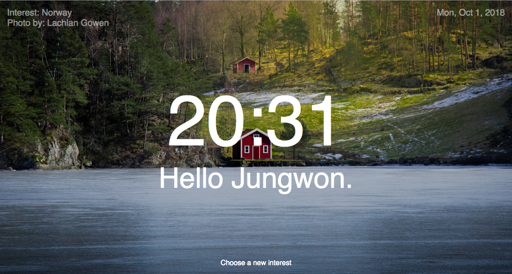

# My Chrome Extension

Build your own Chrome Extension like [Momentum](https://momentumdash.com)

## Getting Started

You can clone and test it, but check this [blog](https://medium.com/@thejungwon/best-html-css-javascript-practice-chrome-extension-ae4e5e7839e?source=friends_link&sk=27380b4f56a7af59e1a16eb4c1b7153b) first.

### Prerequisites

[Unsplash](https://unsplash.com/developers) Developer Token

## Built With

* [jQuery](https://jquery.com/) - jQuery
* [Unsplash](https://unsplash.com/) - Pictures

## License
This project is licensed under the MIT License - see the [LICENSE.md](LICENSE.md) file for details

